<div align="center">


> *Да, мы знаем что делаем. Наверное. (c)*

</div>

# Играемся в модели памяти на Rust

Это игрушечный репозиторий :)

> [!Warning]
> [Модель памяти](https://doc.rust-lang.org/reference/memory-model.html) Rust является неполной и не полностью
> определённой.

## Содержание

- [О тестах](#о-тестах)
- [Закрепление знаний](#закрепление-знаний)
  - `acquire` + `release`:
    - [SpinLock](src/spinlock/README.md)
  - `acquire` + `release` + `relaxed`:
    - [Single-Producer-Single-Consumer Ring Buffer](src/spscringbuffer/README.md)
    - [Single-Producer-Single-Consumer Ring Buffer V2](src/spscringbufferv2/README.md) (cache line bouncing free)
  - `release` + `consume` (ну почти :)) & Double-Checked Locking:
    - [Lazy Initializer](src/lazy/README.md)
  - `acq_rel`:
    - [Shared Pointer](src/sharedptr/README.md)
    - [Shared Pointer V2](src/sharedptrv2/README.md) (implicit `fence` optimizations)
- [Кратко о главном](#кратко-о-главном)
  - [1. Mutual Exclusion](#1-mutual-exclusion)
  - [2. Точка с запятой](#2-точка-с-запятой)
  - [3. Процессор](#3-процессор)
  - [4. Кеши и коммуникация](#4-кеши-и-коммуникация)
  - [5. Store buffering](#5-store-buffering)
  - [6. Reorderings](#6-reorderings)
  - [7. Другие архитектуры и поиск смысла](#7-другие-архитектуры-и-поиск-смысла)
  - [8. ЯП vs Разработчики](#8-яп-vs-разработчики)
  - [9. Здравая позиция - Don't be clever](#9-здравая-позиция---dont-be-clever)
  - [10. Подходы к ММ](#10-подходы-к-мм)
  - [11. Порядки и отношения](#11-порядки-и-отношения)
  - [12. Sequential Consistency (SeqCst)](#12-sequential-consistency-seqcst)
  - [13. Frighten Small Children или SC-DRF](#13-frighten-small-children-или-sc-drf)
  - [14. Отказ от обязательств SC-DRF](#14-отказ-от-обязательств-sc-drf)
  - [15. Гарантии](#15-гарантии)
  - [16. Отношения и частичные порядки](#16-отношения-и-частичные-порядки)
  - [17. Глобальный порядок и допустимые реордеринги](#17-глобальный-порядок-и-допустимые-реордеринги)
  - [18. Гарантии для не-DRF программ](#18-гарантии-для-не-drf-программ)
  - [19. Слабые модели памяти](#19-слабые-модели-памяти)
  - [20. Жизнь без SeqCst](#20-жизнь-без-seqcst)
  - [21. Glitches](#21-glitches)
  - [22. Атомики](#22-атомики)
  - [23. Еще чуть-чуть про реордеринги и частичные порядки](#23-еще-чуть-чуть-про-реордеринги-и-частичные-порядки)
  - [24. TL;DR](#24-tldr)
- [Ссылки](#ссылки)

## Подготовка к работе

Для начала работы поставьте необходимые зависимости: 

```shell
make tools
```

# О тестах

## cargo test

Ничего необычного, просто наивные базовые тесты. 

## Loom

`loom`: https://github.com/tokio-rs/loom

Это инструмент для тестирования параллельных/конкурентных программ.

На высоком уровне он выполняет тесты многократно, перебирая возможные параллельные исполнения каждого теста в
соответствии с тем, что составляет действительные исполнения
согласно [модели памяти C11](https://en.cppreference.com/w/cpp/atomic/memory_order).
Затем он использует методы сокращения состояния, чтобы избежать комбинаторного взрыва количества возможных исполнений.

## Miri

`Miri`: https://github.com/rust-lang/miri

Это интерпретатор для Rust MIR (`Mid-level Intermediate Representation`), который может обнаруживать определенные
классы undefined behavior (**UB**) в Rust-коде, включая:

- Use-after-free
- Data races
- Нарушения алиасинга (`&` и `&mut`)
- Использование неинициализированной памяти
- Нарушения модели памяти

Пример выхлопа при обнаружении data race: 

```shell
MIRIFLAGS=-Zmiri-backtrace=full cargo +nightly miri test
    Finished `test` profile [unoptimized + debuginfo] target(s) in 0.01s
     Running unittests src/main.rs (target/miri/aarch64-apple-darwin/debug/deps/rust_mm_demo-77b44f1f6151d2f7)

running 4 tests
test spinlock::tests::test_basic_lock_unlock ... ok
test spinlock::tests::test_concurrent_increments ... error: Undefined Behavior: Data race detected between (1) non-atomic write on thread `unnamed-3` and (2) non-atomic read on thread `unnamed-4` at alloc46555+0x10
   --> src/spinlock/mod.rs:111:34
    |
111 |                         unsafe { *counter.value.get() += 1 };
    |                                  ^^^^^^^^^^^^^^^^^^^^^^^^^ (2) just happened here
```

# Закрепление знаний

В репозитории представлены структуры, в рамках которых были произведены оптимизации с использованием моделей памяти. 
К каждой реализации добавлено подробное обоснование в соответствующих `README.md`-файлах, опирающиеся на основную 
информацию из основного `README.md`. Рекомендуется сначала познакомиться с основным материалом, чтобы после понимать 
на базе каких фундаментальных догм была описана реализация. 

Структуры: 

- `acquire` + `release`:
  - [SpinLock](src/spinlock/README.md)
- `acquire` + `release` + `relaxed`:
  - [Single-Producer-Single-Consumer Ring Buffer](src/spscringbuffer/README.md)
  - [Single-Producer-Single-Consumer Ring Buffer V2](src/spscringbufferv2/README.md) (cache line bouncing free)
- `release` + `consume` (ну почти :)) & Double-Checked Locking:
  - [Lazy Initializer](src/lazy/README.md)
- `acq_rel`:
  - [Shared Pointer](src/sharedptr/README.md)
  - [Shared Pointer V2](src/sharedptrv2/README.md) (implicit `fence` optimizations)

# Кратко о главном

## 1. Mutual Exclusion

### Определение и проблема

**Взаимное исключение (mutual exclusion)** — это свойство синхронизации потоков, при котором только один поток может
находиться в **критической секции** (участке кода, обращающегося к разделяемому ресурсу) в любой момент времени.

Представьте ситуацию: два потока пытаются одновременно выполнить критическую секцию, модифицируя одну и ту же ячейку
памяти. Без надлежащей синхронизации это приведет к **data race** — недетерминированному и неопределенному поведению
программы.

### Алгоритм Peterson

Классический подход к решению проблемы взаимного исключения — **алгоритм Peterson** (Peterson's Algorithm), предложенный
Gary Peterson в 1981 году. Это элегантный двухпроцессорный алгоритм, работающий только на уровне обычных (неатомарных)
переменных.

#### Идея алгоритма

Алгоритм использует две переменные:

- **want_[i]** — флаг, указывающий, что поток `i` хочет войти в критическую секцию
- **victim_** — переменная, которая указывает, какой поток "пожертвовался" (должен уступить дорогу)

```cpp
void Lock(int t) {
    want_[t] = true;        // поток t выражает желание войти
    victim_ = t;            // поток t "предлагает себя в жертву"
    while (want_[1 - t] && victim_ == t) {
        // Если другой поток хочет войти И он назначен жертвой,
        // то мы ждем (busy-wait)
    }
}

void Unlock(int t) {
    want_[t] = false;       // поток t больше не хочет быть в критической секции
}
```

#### Доказательство корректности (от противного)

Предположим, два потока одновременно находятся в критической секции. Рассмотрим поток, который **последним** выполнил
запись в переменную `victim_`.

Обозначим потоки как T0 и T1. Пусть T1 был последним, кто записал в `victim_`:

```
1. T0: want_[0] = true                   // T0 выражает желание входить
2. T0: victim_ = 0                       // T0 назначает себя жертвой
3. T1: victim_ = 1                       // T1 перезаписывает victim_ = 1
4. T1: want_[0] == true && victim_ == 1  // T1 проверяет условие
```

Если T1 смог пройти через `while` и войти в критическую секцию, то на момент этой проверки (шаг 4):

- `want_[0]` должна быть **false**, ИЛИ
- `victim_` должна быть **не равна 1**

Но мы видим, что:

- `want_[0]` остается **true** (T0 еще не вышла из цикла)
- `victim_` = 1 (только что записано T1)

Это противоречие означает, что T0 не может находиться в критической секции, пока T1 там находится. Алгоритм *
*гарантирует взаимное исключение**.

#### Свойства алгоритма

1. **Взаимное исключение** — только один поток может быть в критической секции
2. **Прогресс** — если процессы не в критической секции, то какой-то из них сможет войти
3. **Справедливость** — процесс не может быть заблокирован навечно (bounded waiting)
4. **Не требует атомарных операций** — работает только с обычными переменными.

### Проблемы и современный контекст

Хотя алгоритм Peterson теоретически корректен, он имеет серьезные проблемы в реальной жизни:

- **Компилятор может оптимизировать код** — переставить инструкции так, что алгоритм сломается
- **Процессор может переупорядочивать операции** — команды памяти выполняются не в том порядке, в каком написаны
- **На современных многопроцессорных системах неэффективен** — busy-wait пожирает CPU

Именно поэтому нам нужна **модель памяти**, которая гарантирует, что такие алгоритмы будут работать предсказуемо. А для
практического использования нам нужны примитивы синхронизации более высокого уровня — мьютексы, семафоры, атомарные
операции.

## 2. Точка с запятой

Когда вы пишете код на высокоуровневом языке, точка с запятой отмечает конец оператора. Но компилятор **не обязан**
исполнять операторы в том порядке, в котором они написаны. Это называется **переупорядочиванием операций компилятором**.

Рассмотрим простой код:

```cpp
a = b + 1; // store to 'a' goes first
b = 1;
```

На первый взгляд, кажется, что операции должны выполняться в порядке:

1. Прочитать `b`
2. Прибавить 1
3. Записать в `a`
4. Записать 1 в `b`

Однако компилятор может сгенерировать совсем другой код (https://godbolt.org/, x86-64, gcc 8.2, -O2):

```asm
movl b(%rip), %eax ; Читаем b в регистр eax
movl $1, b(%rip)   ; Записываем 1 в b         <-- ПЕРВАЯ ЗАПИСЬ
addl $1, %eax      ; Добавляем 1 к eax
movl %eax, a(%rip) ; Записываем результат в a <-- ВТОРАЯ ЗАПИСЬ
ret
```

**Заметьте:** запись в `b` произойдет **ДО** записи в `a`. Это не совпадает с порядком в исходном коде.

Почему компилятор это делает? Компилятор оптимизирует код, чтобы:

- Уменьшить количество обращений к памяти
- Лучше использовать регистры процессора
- Минимизировать задержки доступа к кэшу

Компилятор **уважает две важные зависимости:**

1. **Data Dependency (зависимость по данным)** — если одна операция использует результат другой, их порядок не может
   быть изменен
   ```c
   a = 5;
   b = a + 1;  // Зависит от результата первой строки
   ```
2. **Control Dependency (управляющая зависимость)** — если выполнение одной операции зависит от условия, порядок может
   быть ограничен
   ```c
   if (x > 0) {
       y = z;  // Управляется условием
   }
   ```

Но в нашем примере с `a` и `b` **нет данных или управляющих зависимостей**, поэтому компилятор свободен
переупорядочивать операции.

Проблема возникает в многопоточной программе:

```c
// Поток 1
a = 0;
x = 1;    // Сигнал "готово"

// Поток 2
while (!x) { }    // Ждем сигнал
printf("%d", a);  // Ожидаем увидеть 0
```

Если компилятор переупорядочит запись в `x` и `a`, то Поток 2 может видеть `x == 1`, но при этом `a` все еще содержит *
*мусор** из памяти.

Компилятор не виноват — он не знает, что ваш код многопоточный. Он оптимизирует только для **однопоточного поведения**.

### Решение: явные барьеры

Чтобы предотвратить такое переупорядочивание, необходимо:

1. **Использовать атомарные переменные** — сигнализируют компилятору, что переменная может быть доступна из нескольких
   потоков
   ```rust
   use std::sync::atomic::{AtomicBool, AtomicI32, Ordering};
   
   let a = AtomicI32::new(0);
   let x = AtomicBool::new(false);
   
   // Поток 1
   a.store(0);
   x.store(true);
   ```
2. **Использовать память-барьеры** — явно сказать компилятору: "не переупорядочивай операции через эту точку"
   ```rust
   std::sync::atomic::compiler_fence();
   ```
3. **Полагаться на модель памяти языка** — использовать примитивы синхронизации, которые уже содержат необходимые
   гарантии

### Ключевой вывод

Точка с запятой в исходном коде — это просто синтаксический разделитель, а не гарантия порядка выполнения. Для
многопоточного кода нужно явно указывать, какие операции должны быть видны в определенном порядке, используя механизмы
синхронизации, предусмотренные моделью памяти языка.

## 3. Процессор

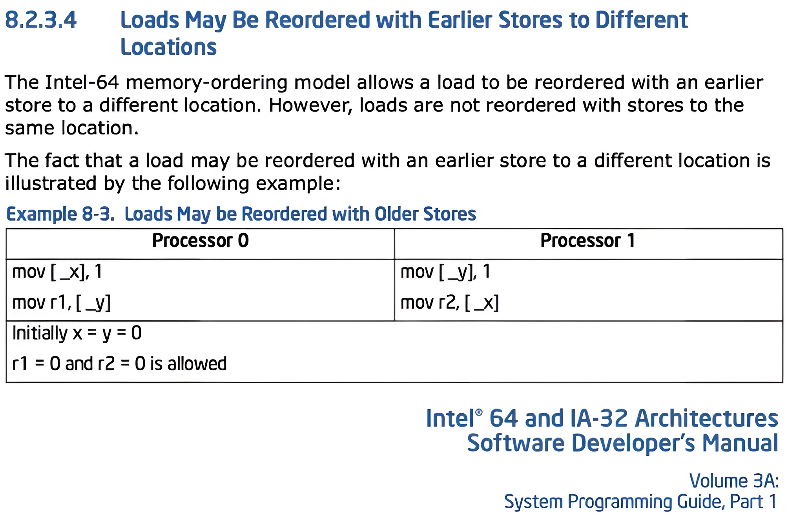

## 4. Кеши и коммуникация

Source: https://www.scss.tcd.ie/jeremy.jones/vivio/caches/ALL%20protocols.htm

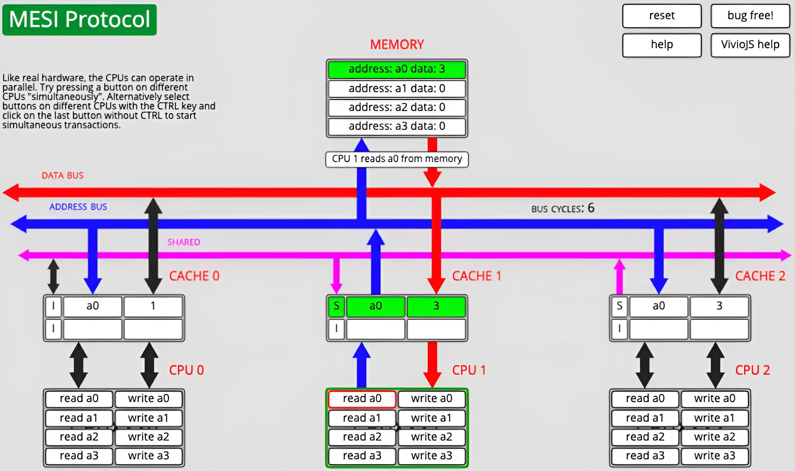

Запись в ячейку памяти в MESI требует захвата кэш-линии в **эксклюзивное** владение. Для этого нужно инвалидировать
кэш-линию в других кэшах.

Коммуникация - это простой ядра, так что процессор пытается на ней **сэкономить**.

## 5. Store buffering

Если процессор не владеет нужной кэш-линией, то он кладет запись в `store buffer`. До протокола когерентности эта запись
не доходит.

> [!NOTE]
> Think of X and Y as files which exist on Larry’s working copy of the repository, Sergey’s working copy, and the
> central repository itself. Larry writes 1 to his working copy of X and Sergey writes 1 to his working copy of Y at
> roughly the same time. If neither modification has time to leak to the repository and back before each programmer
> looks
> up his working copy of the other file, they’ll end up with both r1 = 0 and r2 = 0. This result, which may have seemed
> counterintuitive at first, actually becomes pretty obvious in the source control analogy.

Source: https://preshing.com/20120710/memory-barriers-are-like-source-control-operations/

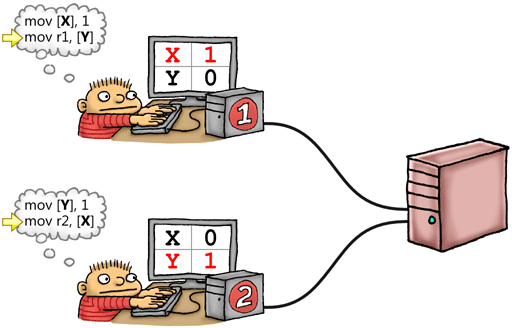

## 6. Reorderings

На х86 из-за буферизации записей последующий load может "обогнать" предыдущий store, если они обращаются к разным
ячейкам памяти.

**Для наблюдателя** инструкции как будто переставились местами - случился **реордеринг**.

> [!Warning]
> Такие рассуждения - сильное упрощение внутренней механики исполнения.

Source: https://github.com/torvalds/linux/blob/master/kernel/futex/waitwake.c#L82

```
 * Where (A) orders the waiters increment and the futex value read through
 * atomic operations (see futex_hb_waiters_inc) and where (B) orders the write
 * to futex and the waiters read (see futex_hb_waiters_pending()).
 *
 * This yields the following case (where X:=waiters, Y:=futex):
 *
 *	X = Y = 0
 *
 *	w[X]=1		w[Y]=1
 *	MB		MB
 *	r[Y]=y		r[X]=x
 *
 * Which guarantees that x==0 && y==0 is impossible; which translates back into
 * the guarantee that we cannot both miss the futex variable change and the
 * enqueue.
 *
 * Note that a new waiter is accounted for in (a) even when it is possible that
 * the wait call can return error, in which case we backtrack from it in (b).
 * Refer to the comment in futex_q_lock().
 *
 * Similarly, in order to account for waiters being requeued on another
 * address we always increment the waiters for the destination bucket before
 * acquiring the lock. It then decrements them again  after releasing it -
 * the code that actually moves the futex(es) between hash buckets (requeue_futex)
 * will do the additional required waiter count housekeeping. This is done for
 * double_lock_hb() and double_unlock_hb(), respectively.
```

## 7. Другие архитектуры и поиск смысла

На х86 из-за буферизации записей последующий load может "обогнать" предыдущий store, если они обращаются к разным
ячейкам памяти.
Но это единственный "плохой" пример для х86. Другие процессоры устроены интереснее (harold face).

Source: https://en.wikipedia.org/wiki/Memory_ordering

- Memory model в PL - составляющая **семантики** языка
- Какой смысл (meaning) имеет многопоточная программа на этом PL (например, С++)?
- До стандарта С++11 формально у многопоточных программ на С++ не было смысла

Главные вопросы к ММ:

- B каком порядке выполняются чтения и записи в разделяемые ячейки памяти из разных потоков?
  (Сама постановка вопроса предполагает, что есть некоторый сквозной порядок...)
- Как **описать** все возможные исполнения **многопоточной** программы?

Второй вопрос куда корректнее, он смотрит в корень проблемы. Но мы все равно не можем наблюдать порядок исполнения всех
обращений к памяти. Об исполнении программы мы судим **по результатам чтений**.

В таком случае, какую запись увидит чтение? Или более прагматично:
**Как гарантировать, что чтение увидит нужную запись**?

А вообще идеально - Как гарантировать, что **чтения** в **последующих** критической секции **увидят записи** из
**предшествующих** критических секций?

```cpp
// Test-and-Set (TAS) spinlock
class SpinLock {
public:
    void lock() {
        while (locked_.exchange(true)) {
        }
    }

    void unlock() {
        locked_.store(false);
    }
}
```

## 8. ЯП vs Разработчики

Разработчик не хочет думать об underlying архитектуре. Он хочет, чтобы его программа предсказуемо* вела себя на разных
процессорах.

> [!Warning]
> Предсказуемо, но не одинаково. Если вы используете слабые модели памяти, то набор возможных исполнений программы может
> различаться на разных архитектурах.

До стандарта С++11 (когда появилась модели памяти) на С++ невозможно было писать портируемый многопоточный код.

### Java

Source: https://docs.oracle.com/javase/specs/jls/se25/html/jls-17.html#jls-17.4

> [!NOTE]
> A memory model describes, given a program and an execution trace of that program, whether the execution trace is a
> legal execution of the program. The Java programming language memory model works by examining each read in an
> execution
> trace and checking that the write observed by that read is valid according to certain rules.
>
> The memory model describes possible behaviors of a program. An implementation is free to produce any code it likes, as
> long as all resulting executions of a program produce a result that can be predicted by the memory model.
>
> This provides a great deal of freedom for the implementor to perform a myriad of code transformations, including the
> reordering of actions and removal of unnecessary synchronization.

### Golang

Source: https://go.dev/ref/mem

> [!NOTE]
> The Go memory model specifies the conditions under which reads of a variable in one goroutine can be **guaranteed to**
> **observe** values produced by writes to the same variable in a different goroutine.

### Linux Kernel

Source: https://github.com/torvalds/linux/blob/master/tools/memory-model/Documentation/explanation.txt

> [!NOTE]
> A memory consistency model (or just memory model, for short) is something which predicts, given a piece of computer
> code running on a particular kind of system, what **values may be obtained by the code's load instructions**. The LKMM
> makes these predictions for code running as part of the Linux kernel.

### C++

А на сладкое C++ :) https://eel.is/c++draft/

```
- 6.9.2 [intro.multithread] Basics › Program Execution > Multi-threaded executions and data races
- 31.4 [atomics.order] Atomics Library > Order and consistency
- 31.11 [atomics.fences] Atomics Library › Fences
```

И как вы можете заметить, ММ размазана по тексту стандарта, очень сложна из-за weak ordering-ов, мотивацию можно понять
только по proposal-ам изменений.

### Rust

Source: https://doc.rust-lang.org/reference/memory-model.html

> [!NOTE]
> The memory model of Rust is incomplete and not fully decided.
>
> While bytes are typically lowered to hardware bytes, Rust uses an “abstract” notion of bytes that can make
> distinctions which are absent in hardware, such as being uninitialized, or storing part of a pointer. Those
> distinctions
> can affect whether your program has undefined behavior, so they still have tangible impact on how compiled Rust
> programs
> behave.

А еще [kek](https://doc.rust-lang.org/nomicon/atomics.html) :)

> [!NOTE]
> Rust pretty blatantly just **inherits the memory model for atomics from C++20**. This is not due to this model being
> particularly excellent or easy to understand. Indeed, this model is quite complex and known to have several flaws.
> Rather, it is a pragmatic concession to the fact that **everyone is pretty bad** at modeling atomics. At very least,
> we can
> benefit from existing tooling and research around the C/C++ memory model. (You'll often see this model referred to
> as "
> C/C++11" or just "C11". C just copies the C++ memory model; and C++11 was the first version of the model but it has
> received some bugfixes since then.)

Подчеркну, **everyone is pretty bad**.

## 9. Здравая позиция - Don't be clever

- Можно ли не думать об ММ?
- Да!

Source: https://go.dev/ref/mem

> [!NOTE]
> Advice
>
> Programs that modify data being simultaneously accessed by multiple goroutines must serialize such access. To
> serialize access, protect the data with channel operations or other synchronization primitives such as those in the
> sync and sync/atomic packages. If you must read the rest of this document to understand the behavior of your program,
> you are being too clever.
>
> **Don't be clever**.

Для синхронизации используем только мьютексы и атомики с то по умолчанию (seq_cst) -> думаем только про переключениях.

> [!NOTE]
> [Note 21: It can be shown that programs that correctly use mutexes and memory_order:: seq_cst operations to prevent
> all data races and use no other synchronization operations behave as if the operations executed by their constituent
> threads were simply interleaved, with each value computation of an object being taken from the last side effect on
> that
> object in that interleaving.

## 10. Подходы к ММ

- **Операционный** - как программа исполняется на процессоре. Предъявляем абстрактную машину, которая исполняет
  многопоточные программы и порождает те же исполнения, что и реальный процессор, но устроена намного проще.
- **Трансформационный** - как меняется программа при исполнении, какие трансформации она испытывает на себе.
- **Декларативный** - какие исполнения программы мы наблюдаем, какие в них есть порядки. Думаем не про реордеринги, а
  **про порядки**.

Fun fact: Семантика С++ - операционная

Сложности с операционными моделями:

- Своя для каждого процессора (исторически развивались независимо), не всегда хорошо описаны
- Допускают неинтуитивные поведения, человеческий разум не подготовлен для этого

Если вы пишете код под конкретную архитектуру, то можете пользоваться **операционной** моделью. Но на уровне PL нужен
другой подход.

## 11. Порядки и отношения

**Декларативная** (аксиоматическая) модель памяти ничего не говорит про механику исполнения, про буферы и барьеры. Она
оперирует **порядками** (ordering) и **отношениями** (relations). **Что гораздо интуитивнее**.

Если говорить об исполнии (см. картинку), то:

- Исполнение = граф
- Вершины - обращения к памяти
- Дуги - частичные порядки / отношения

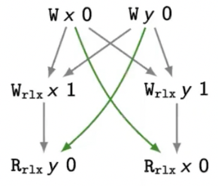

Примеры порядков:

- **modification order** - порядок модификаций отдельной атомарной ячейки памяти
- **program order** - порядок следования обращений к памяти в тексте программы (не в исполнении.)
- **happens-before** - наблюдаемая программой причинность

### Исполнение в C++ ММ

Порядки / отношения, которые образуют исполнение:

- S (synchronization order),
- coherence order
- sequenced before,
- synchronizes with,
- modification order,
- carries a dependency, dependency-ordered before,
- inter-thread happens before, happens before,
- strongly happens before, simply happens before

> [!Warning]
> ММ сложны для понимания, так как смешиваются операционный и декларативный подходы к описанию семантики программ.

## 12. Sequential Consistency (SeqCst)

Если вы откроете документацию вашего любимого PL, ТО увидите там:

> [!NOTE]
> Результат любого исполнения программы **такой же**, как при некотором последовательном исполнении, в котором обращения
> к памяти из каждого потока исполняются в порядке их следования в тексте
> программы.
>
> (c) Leslie Lamport

Что значит **такой же**?

Наблюдать мы (программа) можем только результаты чтений. И уже через них косвенно судить о порядке выполнения обращений
к памяти. Все чтения вернут тот же результат, что и при некотором последовательном исполнении.

> [!Warning]
> Sequentially Consistent Execution != Sequential Execution

Все чтения вернут тот же результат, что и при **некотором последовательном исполнении**. Но исполнять **не обязательно**
последовательно.

По сути можно сказать, что computers are broken! Программа может наблюдать наличие в процессоре store buffer-ов. Но нам
к чему такая косвенность и сложность? А как в целом форсировать порядок и не думать про store buffer?

В процессорах есть специальные инструкции, которые могут форсировать порядок - **барьеры**.

- x86-64: mfence, sfence, lfence
- ARM: dmb, dsb, isb
- POWER: sync, Iwsync, eieio, isync

Упрощенный взгляд: барьеры запрещают отдельные типы реордерингов.(Точная семантика барьеров зависит от конкретной
архитектуры, см. мануалы)

## 13. Frighten Small Children или SC-DRF

KEK x2: https://lwn.net/Articles/575835/

```
On Tue, Dec 10, 2013 at 09:25:39AM -0500, Rik van Riel wrote:
> On 12/09/2013 02:09 AM, Mel Gorman wrote:
> After reading the locking thread that Paul McKenney started,
> wonder if I got the barriers wrong in these functions...

If Documentation/memory-barriers.txt could not be used to frighten small children before, it certainly can now.
```

И я тут согласен, ММ это крайне сложная история. Хочу предостеречь всех кто читает это - не используйте это в
высокоуровневом коде. ММ место только в core-участках сложных систем/фреймворков/утилит/etc.

Но если вернуться к нашей теме, то где ставить барьеры?

Компилятор мыслит **локально** и не понимает в каких местах программы **достаточно** поставить барьеры. Если он будет
консервативно ставить барьеры между каждой парой обращений к памяти, то **умножит на ноль скорость**.

В таком случае ключевая идея - Будем жертвовать программами.

Гарантировать для **произвольной** программы только последовательно согласованные исполнения - **непрактично**. ММ будет
гарантировать видимость последовательного исполнения только для корректно синхронизированных программ -
**программ без гонок**.

Если программа **корректно** синхронизирована, то в ней достаточно расставить немного барьеров, причем компилятор будет
понимать, где их ставить (с нашими подсказками).

- Мы (разработчики) получим видимость последовательного исполнения.
- В то же время оставим компилятору / процессору пространство для реордерингов.

Следовательно, мы можем сказать:

> [!Warning]
> Если в программе нет гонок* (**data-race-free**), то она допускает только последовательно согласованные исполнения.

Пока неформально: гонку (**data race**) образуют два неупорядоченных синхронизацией неатомарных обращения к одной ячейке
памяти, среди которых по крайне мере одно обращение - одна запись. Формальное определение гонки мы дадим позже.

Последовательная согласованность для программ без гонок - это основа модели памяти любого современного PL.

Примеры: Java, C++11, Golang

При этом в разных языках есть свои излишества:

- В С++ - слабые порядки: release/acquire, relaxed, consume (господь-господь)
- B Java - семантика для программ с гонками

В C++ об это сказано следующее:

> [!NOTE]
> Note 21: It can be shown that programs that correctly use mutexes and memory_order:: seg_est operations to prevent all
> data races and use no other synchronization operations behave as if the operations executed by their constituent
> threads were simply interleaved, with each value computation of an object being taken from the last side effect on
> that object in that interleaving. **This is normally referred to as "sequential consistency"**. **However, this**
> **applies only to data-race-free programs**, and data-race-free programs cannot observe most program transformations
> that do not change single-threaded program semantics. In fact, most single-threaded program transformations continue
> to be allowed, since any program that behaves differently as a result has undefined behavior.

А это значит, что **SC-DRF** (sequential consistent data-race free) - это контракт между программистом, компилятором и
процессором:

- Программист обязуется написать корректно синхронизированную (в рамках модели) программу.
- Компилятор + процессор обязуются выполнить эту программу так, что программист не сможет отличить исполнение от
  последовательного.

Контракт фиксируется в **стандарте** языка программирования.

## 14. Отказ от обязательств SC-DRF

Программист обязуется написать корректно синхронизированную (в рамках модели) программу. **Компилятор и процессор**
предполагают, что вы соблюдаете свою часть соглашения, они **ничего не проверяют**.

Если вы нарушили его, то в С++ вы получаете **UB**.

Но тогда как построить ММ? И что это вообще значит?

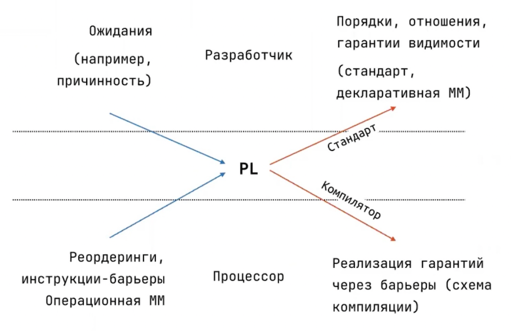

- `[Модель]` Какие порядки на обращениях к памяти / гарантии на видимость записей в программе должны соблюдаться при ее
  исполнении
- `[Реализация]` Как обеспечить эти порядки / гарантии через **барьеры** на конкретной архитектуре?

А ничего, остается **формализовать ожидания**, которыми мы пользуемся в примитивах синхронизации и даже в простых
однопоточных программах.

**Ничего очевидного больше нет**. Процессор и компилятор исполняют не совсем нашу программу и не совсем в модели
чередования.

Нам нужно говорить **о гарантиях** и исходить от них, больше у нас ничего нет.

## 15. Гарантии

### Порядок - Program Order

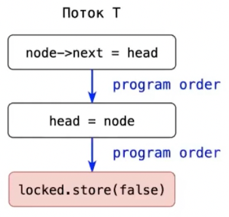

Внутри одного потока есть естественный порядок - порядок следования обращений к памяти в тексте программы -
**program order**. В модели памяти C++ program order называется **sequenced-before**.

В коде есть ветвления (бранчи), циклы. Чуть аккуратнее: **program order** - это порядок, в котором инструкции потока
попадают в процессор (в предположении, что компилятор неоптимизирующий). А еще есть неопределенный порядок вычисления
аргументов функций...

НО ГЛАВНОЕ! **program order** - это не порядок исполнения обращений к памяти. Это порядок на обращениях, заложенный в
**тексте программы**.

> [!Warning]
> **Гарантия для однопоточной программы**:
>
> Чтение ячейки памяти наблюдает **последнюю предшествующую** program order запись.

А что насчет многопоточной? Сначало стоит разобрать **конфликты**.

(НАИВНО) Два обращения к памяти **конфликтуют**, если:

- они обращаются к одной и той же ячейке памяти,
- по крайней мере одно из этих обращений - запись.

C++ MM (6.9.2.1):

> [!NOTE]
> Two expression evaluations conflict if one of them modifies a memory location (`[in-tro.memory]`) and the other one
> reads or modifies the same memory location.

Java MM:

> [!NOTE]
> Two accesses to (reads of or writes to) the same variable are said to be conflicting if at least one of the
> accesses is write.

Через конфликты разделяемые переменные в корректно синхронизированной программе можно поделить на два класса:

1) Используются для синхронизации: конфликтующие обращения не упорядочены, конфликты - суть синхронизации:
   `Флаг locked в спинлоке`
2) Конфликтующие обращения упорядочены через примитивы и синхронизации, т.е. через разделяемые переменные первого типа.
   `Раздреляемое состояние, защищенное спинлоком`

Для первых у нас и существуют атомики. Укажем компилятору на переменные для синхронизации с помощью явной аннотации:

```cpp
std::atomic<bool> locked_{false};
```

Аналог атомиков в Java - **volatile** *(в части visibility и ordering гарантий)*. Однако для RMW операций нужны классы из java.util.concurrent.atomic.*. Они дают те же гарантии плюс атомарность составных операций. Стоит учесть, что при этом в С++ y volatile нет такой семантики.

### Порядок - Modification Order

На каждом атомике в исполнении реализуется **modification order** - порядок на всех записях (store, RMW) в этот атомик.

По сути атомик это и есть sequentially consistent ячейка памяти

C++ MM:

> [!NOTE]
> All modifications to a particular atomic object M occur in some particular total order, called the
> **modification order** of M.
>
> Note 3: There is a separate order for each atomic object. **There is no requirement that these can be combined into**
> **a single total order for all objects**. In general this will be impossible since different threads can observe
> modifications to different objects in inconsistent orders.

А значит,

> [!Warning]
> **Гарантия для однопоточной программы**:
>
> Чтение ячейки памяти наблюдает **последнюю предшествующую** program order запись.

### Порядок - Message Passing (happens-before)

| T0                                       | T1                                                |
|------------------------------------------|---------------------------------------------------|
| write to buffer <br/> ready.store(true); | if (ready.load)) { <br/> read from buffer <br/> } |

Естественно потребовать от модели памяти, чтобы в такой программе чтение буфера в потоке Т1 всегда видело запись в буфер
в потоке ТО:

_Раз мы читаем буфер, то увидели, что флаг взведен, а значит поток ТО уже выполнил запись в буфер, поскольку в тексте
программы эта запись предшествовала взводу блага._

Итого, запись в буфер произошла до чтения из него, a значит мы обязаны ее увидеть. Мы хотим **формализовать** эту
интуицию и сделать ее **требованием** к исполнению. Для этого нам потребуется понятие **happens-before**.

Например, в распределенной системе узлы общаются обмениваясь сообщениями:

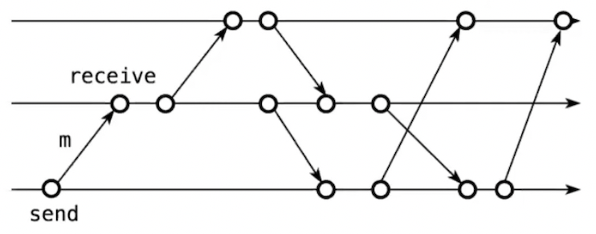

Как в такой модели определить, что одно событие произошло раньше другого, не прибегая к показаниям часов (им нельзя
доверять)?

1) Если событие `а` предшествовало событию `b` в пределах одного узла, то `a` **happens-before** `b`.
2) Если событие `а` - это отправка сообщения, а событие `b` получение этого сообщения, то `a` **happens-before** `b`.
3) Замыкаем по транзитивности -> получаем **happens-before** - частичный порядок на событиях в системе.

### Causality и Concurrency

Частичный порядок **happens-before** отражает причинность (**causality**) событий, а не течение времени:
`a` **happens-before** `b` означает, что событие `а` могло повлиять на событие `b`:

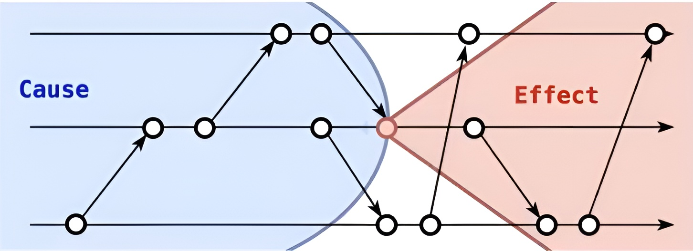

(!) Если события не упорядочены **happens-before**, то говорят, что они **concurrent**.

Но как тогда перенести определение **happens-before** на разделяемую память? А ровно также как на схеме. Иначе говоря,
как в многопоточной программе выглядит:

1) локальный шаг
2) передача сообщения

То есть, по сути своей имеем:

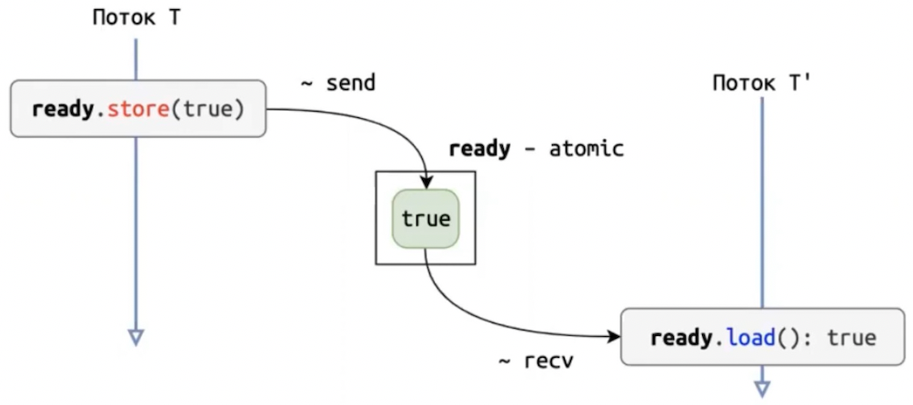

- **Сообщение** - содержимое ячейки памяти (атомика)
- **Отправка сообщения** - запись значения в атомик
- **Доставка сообщения** - чтение значения из атомика

(!) Отмечу, что операция **exchange** - RMW-операция (Read-Modify-Write), чтение + запись.

### Порядок - Synchronizes-With

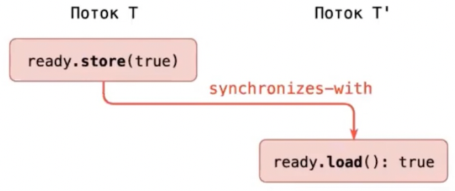

Пусть `а` - запись в некоторый атомик, а `b` - чтение из этого атомика в **другом** потоке.

Скажем, что `a` **synchronizes-with** `b`, если `b` прочитало значение, записанное `а`.

> [!NOTE]
> Это упрощённое определение. Полное определение из стандарта C++
> ([atomics.order#2](https://eel.is/c++draft/atomics.order#2.sentence-1)):
>
> Release store `A` **synchronizes-with** acquire load `B` на том же атомике `M`, если `B` читает
> значение из **release sequence headed by `A`**.
>
> **Release sequence** ([intro.races](https://eel.is/c++draft/intro.races#def:release_sequence)) -
> максимальная непрерывная подпоследовательность side effects в **modification order** `M`, где
> первая операция - release store `A`, а каждая последующая это атомарная **RMW-операция** (любого потока).
>
> Почему это важно: без release sequence **synchronizes-with** не работал бы через промежуточные потоки.
> Например, в [SharedPtr](src/sharedptr/README.md) поток T1 делает release store (первый `fetch_sub`), а поток T3 - acquire load
> (последний `fetch_sub`). Между ними поток T2 делает свой `fetch_sub` (RMW). Благодаря release sequence,
> цепочка T1 -> T2 -> T3 сохраняет **synchronizes-with**, и T3 видит все записи T1 и T2 перед вызовом
> деструктора.

### Видимость в happens-before

Каждое чтение не-атомика читает **последнюю** предшествующую в порядке **happens-before** запись в эту переменную.

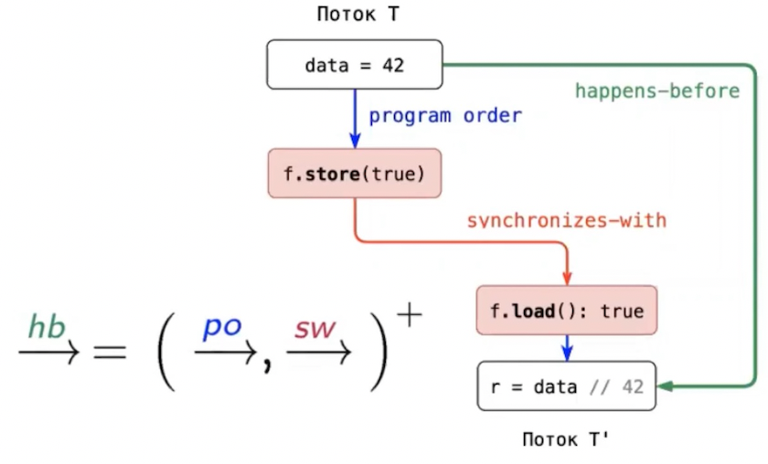

Но что если в одно чтение ведут сразу две цепочки **happens-before**?

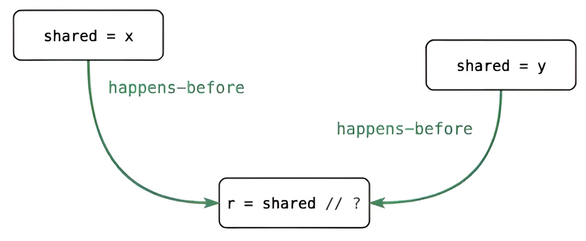

Ну в таком кейсе мы вернемся к правилам DRF, а значит это **неправильная программа** (см. пункты 13 и 14).

### Полноценное определение Data Race

Если учесть всё что обсудили выше, то мы теперь можем теперь формализовать корректное, не наивное определение.

Два обращения к памяти **конфликтуют**, если

- они обращаются к одной и той же ячейке памяти,
- по крайней мере одно из этих обращений - запись.

Гонкой (**data race**) в исполнении назовем два конфликтующих неатомарных (не через атомик) обращения к памяти, которые
не упорядочены через **happens-before**.

C++ MM:

> [!NOTE]
> The execution of a program contains a **data race** if it contains two potentially concurrent **conflicting** actions,
> at least one of which is not atomic, and neither **happens-before** the other, except for the special case for signal
> handlers described below.

Java MM:

> [!NOTE]
> When a program contains two **conflicting** accesses (§17.4.1) that are not ordered by a **happens-before**
> relationship, it is said to contain a **data race**.

И тут же, неотходя от кассы, упорядоченность в исполнении двух обращений к памяти через **happens-before** не означает,
что **первое** было выполнено **раньше другого**.

И наоборот, если запись в не-атомик int shared была выполнена за полчаса до чтения из shared, то вовсе не обязательно
между ними реализуется **happens-before**.

> [!Warning]
> **happens-before** - про **причинность**, а не про время.

### Порядок - Synchronization Order

С учетом перечисленного, мы попросим у компилятора глобально упорядочить обращения к таким переменным, а он рассыпет
нужные барьеры рядом с этими обращениями. Мы не хотим упорядочивать барьерами **все обращения** к памяти в программе. Но
обращения к некоторому подмножеству переменных - все же хотим (ожидаем, что их будет **не очень много**).

И в таком случае, нам нужен новый уровень частичных порядков - **Synchronization Order**. В исполнении все вызовы
`.store(value)` и `.load()` (и BCE другие операции) на всех атомиках будут глобально упорядочены.

С помощью этого порядка мы умеем отвечать на вопрос "какую запись увидит чтение?" для атомиков:

> [!Warning]
> **Гарантия для многопоточной программы**:
>
> Чтение атомика увидит последнюю предшествующую в **synchronization order** запись в тот же атомик.

Java MM:

> [!NOTE]
> Every execution has a synchronization order. A synchronization order is **a total order over all of the**
> **synchronization actions of an execution**. For each thread t, the synchronization order of the synchronization
> actions (§17.4.2) in tis consistent with the program order (§17.4.3) of t.

## 16. Отношения и частичные порядки

- **Modification order** (mo) - порядок записей в каждый отдельный атомик
- **Happens-before** (hb) - транзитивное замыкание **program order** и **synchronizes-with**, наблюдаемая программой
  причинность
    - **Program order** (po, sb) - порядок следования обращений к памяти в тексте программы для каждого из потоков
    - **Synchronizes-with** (sw) - отношение, связывающее атомарное чтение из атомика с записью, которое это чтение
      увидело
- **Synchronization order** (S) - сквозной порядок на всех обращениях ко всем атомикам

Исполнение - согласованная (объединение порядков S, mo и hb - ациклично) реализация (воплощение) этих порядков

## 17. Глобальный порядок и допустимые реордеринги

Для видимости глобального порядка, достроим **synchronization order** и **happens-before** до линейного порядка `Т` на
всех обращениях к памяти.

Этот порядок `Т` - кандидат на последовательное исполнение, который объяснит все чтения в программе.

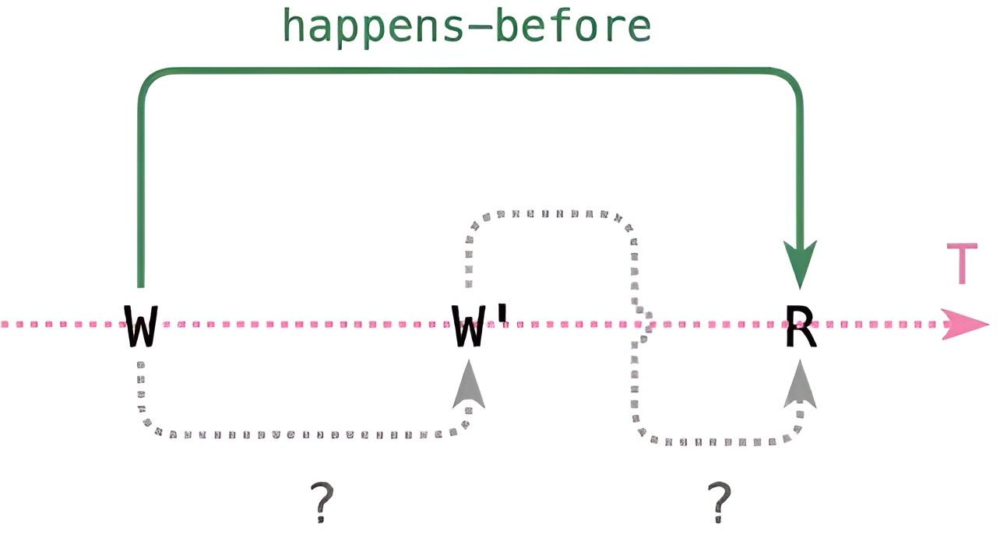

Легенда:

- R - чтение не-атомика
- W - последняя в **happens-before** запись в соответствующую переменную
- W' - последняя в запись в эту переменную.

По итогу мы получаем видимость последовательного исполнения, но только для программ **без гонок**. Но что мы выиграли?

А тут все просто - компилятор и процессор теперь могут безопасно реордерить обращения к памяти.

То есть, если в программе нет гонок, то поток `Т'` может увидеть одну из неатомарных записей `{W}` только когда
реализовалась `hb`, т.е. только после синхронизации через атомик. Но после синхронизации поток `Т'` видит сразу все
записи из потока `Т`, а значит не может наблюдать их **относительный** порядок. А значит `{W}` можно "реордерить".

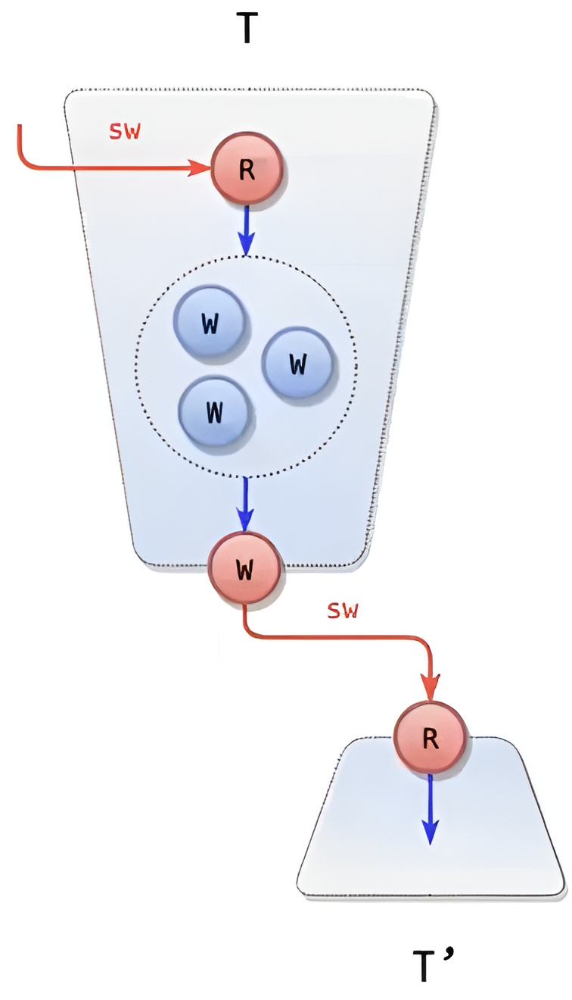

Тоже справедливо и для mutex:

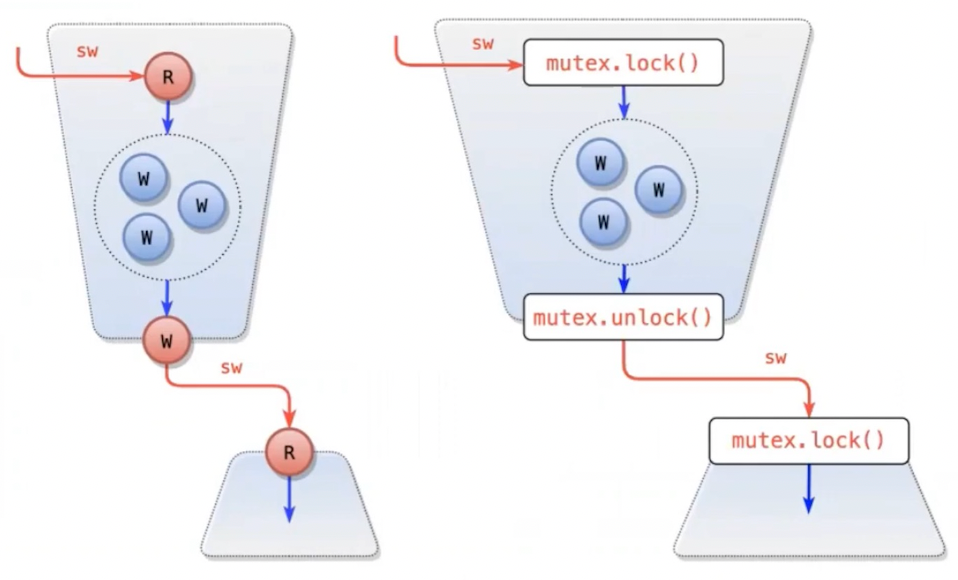

Как итог, мы получаем безопасные **локальные** реордеринги, которые не нарушают видимость последовательного исполнения
для программ без гонок. Но только для корректно синхронизированных программ (программ без гонок, **data-race-free**).

## 18. Гарантии для не-DRF программ

Если в программе есть гонки, то видимость последовательного исполнения программе больше **не гарантируется**.

Программа **может наблюдать** оптимизации процессора: store buffer-ы, неатомарное распространение записей и т.п.

Разные языки дают разные гарантии для программ с гонками, в C++ data race - это **UB**.

## 19. Слабые модели памяти

Модель памяти называется **слабой (weak)**, если она допускает не-sequentially consistent исполнения.
Выбрав хотя бы один memory order < `seq_cst`, вы

- теряете право использовать модель чередования
- даете большую свободу процессору (например, программа наблюдает наличие store buffer)

Если мы лишаемся видимости глобального порядка на обращениях к памяти, то что остается? (Гарантии от сильных к слабым)

- `seq_cst`: **synchronization order** + **happens-before** + **modification order**
- `release` + `acquire`: ~~synchronization order~~ + **happens-before** + **modification order**
- `relaxed`: ~~synchronization order~~ + ~~happens-before~~ + **modification order**

Если без душки, то оптимальная синхронизация в **декларативной** ММ (самые слабые допустимые memory order-ы).
Следовательно получаем оптимальные барьеры на каждой целевой архитектуре (меньше "стрелок" в модели -> меньше
ограничений для процессора при исполнении программы).

## 20. Жизнь без SeqCst

Большинству программ SeqCst не нужна, потому что потоки в них коммуницируют через каналы или фьючи.

> [!Warning]
> Don't communicate by sharing memory, share memory by communication

## 21. Glitches

> [!NOTE]
> Rust pretty blatantly just inherits the memory model for atomics from C++20. This is not due to this model being
> particularly excellent or easy to understand. Indeed, this model is quite complex and known to have several flaws.
> Rather, it is a pragmatic concession to the fact that everyone is pretty bad at modeling atomics. At very least, we
> can benefit from existing tooling and research around the C/C++ memory model.

```js
// [Note 7: The recommendation similarly disallows r1 == x2 == 42 in the following example, 
// with x and y again initially zero:
// Thread 1:
r1 = x.load(memory_order::relaxed);
if (rl == 42) y.store(42, memory_order::relaxed);
// Thread 2:
r2 = y.load(memory_order::relaxed);
if (r2 == 42) x.store(42, memory_order::relaxed);
// — end note]
```

## 22. Атомики

Доступ к атомарным RMW-операциям - не единственное назначение атомиков.

Атомики - это **аннотация** для компилятора, это точки программы, в которых он должен расставить барьеры.

## 23. Еще чуть-чуть про реордеринги и частичные порядки

Думать про реордеринги и барьеры сложно и не универсально. Не делайте этого.

Декларативная ММ дает вам интуитивный инструмент - **частичные порядки**, которые можно наблюдать в исполнении.

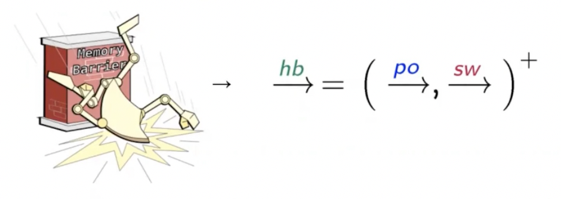

Как ими пользоваться?

- Если вы сделали запись в ячейку памяти (не-атомик), а потом ожидаете прочитать эту запись в другом
  потоке, то обеспечьте между ними **happens-before**.
- Если у вас в программе есть конфликтующие обращения к неатомарным переменным, то обеспечьте между ними
  **happens-before**.

## 24. TL;DR

> [!Warning]
> Don't be clever! Don't communicate by sharing memory, share memory by communication.

1) Мы пишем корректно синхронизированную программу аннотируем переменные, через которые синхронизируются потоки.
2) Компилятор в соответствии с нашими аннотациями расставляет в генерируемом коде барьеры.
3) Процессор реордерит инструкции, буферизирует записи, но аккуратно, не пересекает границы барьеров.

Если никто из трех участников не ошибся, то программа наблюдает только последовательно согласованные исполнения.

# Ссылки

- [Awesome Concurrency](LINKS.md)
