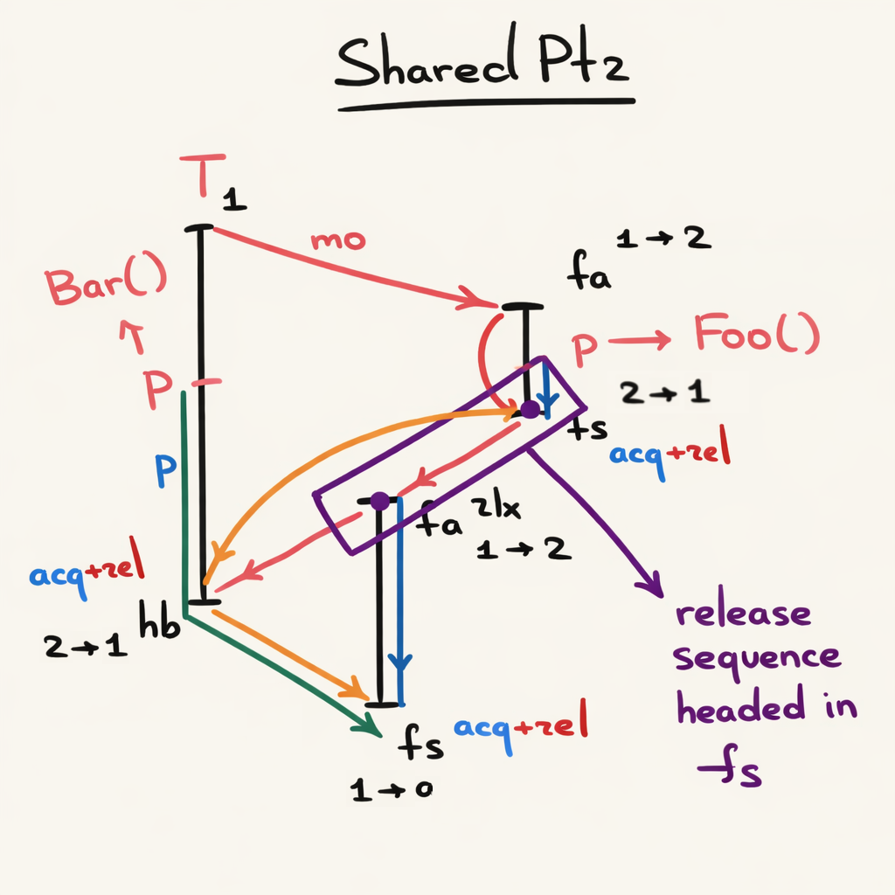

# SharedPtr (V1 — наивный AcqRel)

**SharedPtr** — указатель с подсчётом ссылок (аналог `std::shared_ptr` / `Arc`), демонстрирующий использование
`memory_order_acq_rel` на RMW-операциях (Read-Modify-Write).

## Структура

```
  SharedPtr         SharedInner (heap)
 ┌─────────┐       ┌──────────────────────────┐
 |  inner  |──────>|  ref_count: AtomicUsize  |
 └─────────┘       |  data: T                 |
                   └──────────────────────────┘
```

- `inner` — сырой указатель на аллоцированный в куче `SharedInner`
- `ref_count` — атомарный счётчик ссылок
- `data` — пользовательские данные

## Почему AcqRel

В предыдущих примерах (SpinLock, Lazy, SPSC) мы использовали отдельные `Acquire`-load и `Release`-store.
Это работает, потому что load и store — разные операции на разных шагах.

В SharedPtr ситуация другая: `fetch_add` и `fetch_sub` — **RMW-операции**, которые одновременно
читают и пишут. Для RMW-операций `AcqRel` означает:

- **Acquire-часть** (чтение): видит все записи, опубликованные предшествующими Release-операциями
- **Release-часть** (запись): публикует все записи этого потока для последующих Acquire-наблюдателей

## Memory Orders

### `clone`

```rust
fn clone(&self) -> Self {
    unsafe { &*self.inner }
        .ref_count
        .fetch_add(1, Ordering::AcqRel); // (1)
    Self { inner: self.inner }
}
```

| #   | Операция              | Memory order | Обоснование                                                                                       |
| --- | --------------------- | ------------ | ------------------------------------------------------------------------------------------------- |
| 1   | `ref_count.fetch_add` | **AcqRel**   | RMW: Release публикует инкремент, Acquire видит текущее состояние ref_count в modification order. |

### `drop`

```rust
fn drop(&mut self) {
    let prev = unsafe { &*self.inner }
        .ref_count
        .fetch_sub(1, Ordering::AcqRel); // (2)

    if prev == 1 {
        unsafe { drop(Box::from_raw(self.inner)); } // (3)
    }
}
```

| #   | Операция                     | Memory order | Обоснование                                                                                                                                                                         |
| --- | ---------------------------- | ------------ | ----------------------------------------------------------------------------------------------------------------------------------------------------------------------------------- |
| 2   | `ref_count.fetch_sub`        | **AcqRel**   | RMW: Release публикует все записи потока (модификации данных через `&T`). При `prev == 1` Acquire гарантирует видимость всех записей всех потоков, делавших предыдущие `fetch_sub`. |
| 3   | `Box::from_raw` (деструктор) | —            | Безопасно: AcqRel на (2) при `prev == 1` установил happens-before со всеми предыдущими drop-операциями через release sequence.                                                      |

## Release Sequence



На диаграмме сценарий с тремя потоками:

- **T1** создаёт объект `Bar()`, передаёт указатель `p` в другой поток через **mo** (modification order)
- `p → Foo()`: второй поток обращается к данным через `deref`
- **`fa`** (`fetch_add`, 1 -> 2): clone с `Relaxed`, инкрементирует refcount
- **`fs`** (`fetch_sub`, 2 -> 1 и 1 -> 0): drop с `Release`, декрементирует refcount
- **`fa rlx`** (1 -> 2): промежуточная RMW-операция, часть release sequence
- Последний `fs` (1 -> 0) с `AcqRel` / `fence(Acquire)`: синхронизируется со всей **release sequence headed by `fs`**, вызывает деструктор

Ключевой момент: `synchronizes-with` работает через промежуточные потоки.

```
T1 (clone)           T2 (drop)            T3 (drop, последний)
──────────           ─────────            ────────────────────
fetch_add(AcqRel)
   1 -> 2
                     fetch_sub(AcqRel)
                        2 -> 1
                                          fetch_sub(AcqRel)
                                             1 → 0
                                          <- видит ВСЕ записи T1 и T2
                                          drop(Box::from_raw)
```

Все `fetch_add`/`fetch_sub` — RMW-операции в **modification order** атомика `ref_count`.
Они образуют **release sequence**, headed by первым Release store.

Согласно стандарту ([atomics.order#2](https://eel.is/c++draft/atomics.order#2.sentence-1)):

> Release store `A` **synchronizes-with** acquire load `B`, если `B` читает значение
> из **release sequence headed by `A`**.

Поэтому T3, выполняя `fetch_sub(AcqRel)` и получая `prev == 1`, синхронизируется со всей
цепочкой предыдущих RMW-операций и видит побочные эффекты всех потоков перед вызовом деструктора.

## Оптимизация

Эта версия использует AcqRel **везде** — это корректно, но избыточно. 

См. [Shared Pointer V2](src/sharedptrv2/README.md) для оптимизированной версии с 
`Relaxed` / `Release` + `fence(Acquire)`, как в `std::sync::Arc`.
